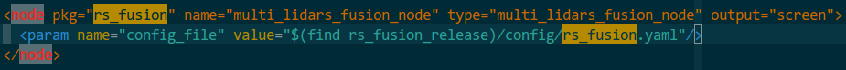
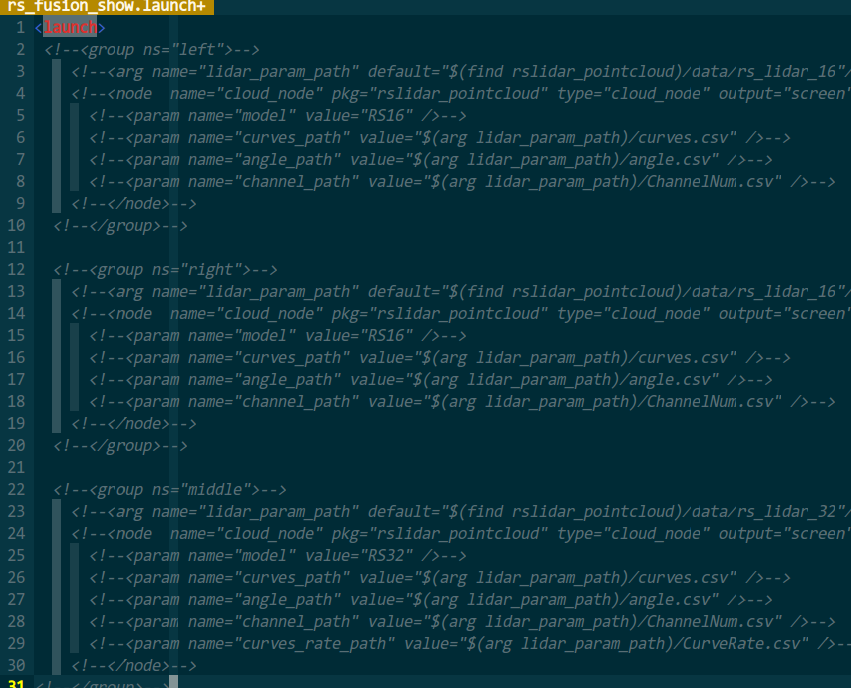

# rs_fusion用户使用说明


- 修订日期：2018-11-17  


## 1 功能说明

  将2个或3个lidar点云融合为单个点云重新发布，同时可以融合imu和车速信息对原始lidar点云进行运动补偿。
## 2 安装卸载deb

**1 安装**

```shell
sudo dpkg -i ./ros-kinetic-rs-fusion_1.1.1-0xenial_amd64.deb
source /opt/ros/kinetic/setup.sh
```

**2. 检查安装是否成功**

```shell
roscd rs_fusion
```
目录切换到`/opt/ros/kinetic/share/rs_fusion `则成功安装

**3. 卸载**

如需卸载，执行

```
sudo apt-get remove ros-kinetic-rs-fusion 
```


##  3. 工程配置
### 1. 文件列表

| 文件                | 说明                              | 备注                                                         |
| ------------------- | --------------------------------- | ------------------------------------------------------------ |
| rs_fusion.yaml      | 工程配置文件                      |                                                              |
| trans_params_0.yaml | lidar_base相对车体的标定文件      | (x,y,z,roll,pitch,yaw)采用**国际标准单位**`米`和`弧度`       |
| trans_params_1.yaml | lidar_1相对lidar_base的的标定文件 | 同上                                                         |
| trans_params_2.yaml | lidar_2相对lidar_base的的标定文件 | 同上，`rs_fusion_motion.yaml/`lidars_number: 3时，此文件不被解析 |


### 2. 配置`config/rs_fusion.yaml`
**`rs_fusion.yaml`参数列表**

|                       |                                                 |                                                              |
| --------------------- | ----------------------------------------------- | ------------------------------------------------------------ |
| lidars_number:        | lidar的数量`int`                                | 1, 2 or 3，等于2时lidar_2_topic将被忽略;等于1时lidar_1_topic、lidar_2_topic将被忽略 |
| lidar_base_topic:     | 标定基准lidar的 topic`sensor_msgs::PointCloud2` | 如：/middle/rslidar_points，                                 |
| lidar_1_topic:        | lidar1的 topic`sensor_msgs::PointCloud2`        | 如：/left/rslidar_points                                     |
| lidar_2_topic:        | lidar2的 topic`sensor_msgs::PointCloud2`        | 如：/right/rslidar_points                                    |
| fusion_topic:         | 融合后点云的消息名字`string`                    | 如：/fusion_points                                           |
| lidar_base_trans_file | 基准lidar标定文件名`yaml`                       | 文件固定保存在`rs_fusion/config`文件夹下                     |
| lidar_1_trans_file    | lidar1标定文件名`yaml`                          | 文件固定保存在`rs_fusion/config`文件夹下                     |
| lidar_2_trans_file    | lidar2标定文件名`yaml`                          | 文件固定保存在`rs_fusion/config`文件夹下                     |
| motion_compensate:    | 运动补偿开关 `int`                              | 0 or 1, 0:以下参数将被屏蔽                                   |
| imu_topic:            | imu消息 `sensor_msgs/Imu`                       | /nav440/nav440                                               |
| imu_z_up              | imu z轴方向`int`                                | 1:z up; -1: z down                                           |
| odometry_topic:       | 车速 `nav_msgs/Odometry`                        | 如：/canbus/canbus                                           |
| odometry_unit:        | 车速单位`int`                                   | 0: m/s; 1: km/h;                                             |


- 2个雷达配置样例

```shell
lidars_number: 2 # lidar的数量
lidar_base_topic:  /left/rslidar_points
lidar_1_topic: /right/rslidar_points

lidar_base_trans_file: trans_params_0.yaml
lidar_1_trans_file: trans_params_1.yaml

fusion_topic: /fusion_points     #融合后点云的消息名字

motion_compensate: 1    # 运动补偿开关，0 or 1, 等于0时以下参数将被忽略
imu_topic: /imu 
imu_z_up: 1    # 1:z up; -1: z down
odometry_topic: /speed
odometry_unit: 0   # 0: m/s; 1: km/h;

```


- 3个雷达配置样例

```shell
lidars_number: 3 # lidar的数量
lidar_base_topic: /middle/rslidar_points
lidar_1_topic: /left/rslidar_points
lidar_2_topic: /right/rslidar_points

lidar_base_trans_file: trans_params_0.yaml
lidar_1_trans_file: trans_params_1.yaml
lidar_2_trans_file: trans_params_2.yaml

fusion_topic: /fusion_points     #融合后点云的消息名字

motion_compensate: 0    # 运动补偿开关，0 or 1, 等于0时以下参数将被忽略
imu_topic: /nav440/nav440 
imu_z_up: 1    # 1:z up; -1: z down
odometry_topic: /canbus/canbus
odometry_unit: 0   # 0: m/s; 1: km/

```


### 3. 配置`launch/rs_fusion_show.launch`

**１　配置yaml文件**  




**2  配置驱动**  

根据是否需要在此launch中调用lidar驱动，决定是否注释launch文件中驱动相关代码。建议使用录制`sensor_msgs::PointCloud2`的rosbag来存放离线数据。




### 4. 运行

1 打开一个终端运行

```shell
 roslaunch rs_fusion_release rs_fusion_show.launch
```

2 打开一个新的终端

在线使用或者播放`rslidar_packets `rosbag使用

```shell
roslaunch rslidar_pointcloud rs_fusion_testdata.launch
```

3 打开一个新的终端

播放离线rosbag或在线采集数据

```shell
rosbag play xxx_test.bag 
```


